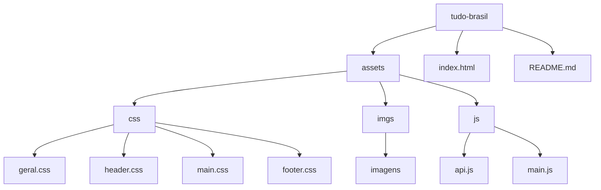

# 🌐 Site de notícias TudoBrasil
<p>
  Bem-vindo ao meu projeto de site de notícias TudoBrasil. Nele vocês podem observar 100 notícias sempre atualizadas do Brasil.<br>
  Este projeto foi desenvolvido de forma totalmente autoral para aperfeiçoar meus conhecimentos sobre api's em Javascript, 
  desmonstrando por meio da <a href="https://newsapi.org/">NewsAPI</a> notícias adquiridas do território brasileiro.
</p>

## 📄 Sobre o projeto
<p>Neste projeto você irá encontrar notícias 100% atualizadas do Brasil, sobre os mais diversos assuntos, adquiridos pela API citada e um loyalt totalmente autoral. 
  As informações foram distribuidas e organizadas utilizando de HTML e CSS principalmente.</p>

<br>


<br>

<p><strong>Nota: Este projeto utiliza a NewsAPI. Devido às restrições do plano gratuito da API, os resultados só podem ser visualizados correndo o projeto localmente (localhost).</strong></p>

<br>

<p>Para vizualizar o site localmente, siga as seguintes etapas:</p>

```

git clone https://github.com/kenzofrias/tudo-brasil.git

```

<p>Navegue até o diretório raiz do projeto:</p>

```bash

cd tudo-brasil

```

<p>Abra o arquivo <strong><i>index.html</i></strong> em seu navegador de preferência e desfrute.</p>


## 📁 Estrutura do projeto



<!-- 
## ✏️ Projetos
<p>
  Abaixo seguem alguns projetos que foram desenvolvidos junto ao curso com algumas alterações em metologias e formas de apresentação.
</p>
<ul>
  <li>
    <a href="https://github.com/kenzofrias/javascript-developer/tree/main/projetos/pokedex">Repositório Pokedéx Original</a>
    <details>
      <a href="https://kenzofrias.github.io/js-developer-pokedex/">
        
      </a>
      <p align="right" fontsize="0.7">
        clique na imagem para vizualizar o projeto funcionando
      </p>
    </details>
  </li>

  <li>
    <a href="https://github.com/kenzofrias/javascript-developer/tree/main/projetos/portfolio-dio">Repositório Portfolio Original</a>
    <details>
      <a href="https://kenzofrias.github.io/js-developer-portfolio/">
        
      </a>
      <p align="right" fontsize="0.7">
        clique na imagem para vizualizar o projeto funcionando
      </p>
    </details>
  </li>
</ul> -->

## 💻 Tecnologias
- ``Javascript``
- ``HTML``
- ``CSS``
- ``Google Antigravity (IDE)``

## 🧑🏽‍💻 Autores
- [Kenzo Friás](https://www.github.com/kenzofrias)
